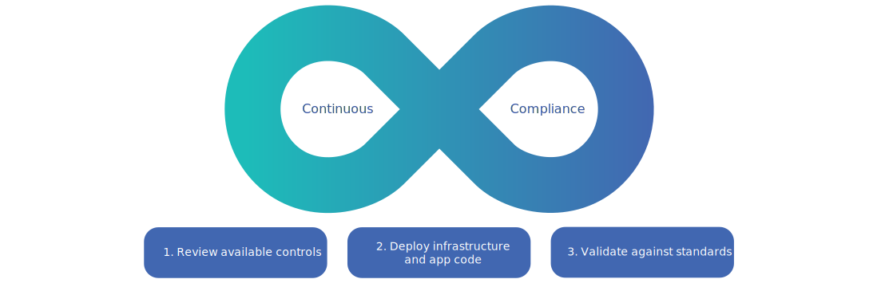

---

copyright:
  years: 2023
lastupdated: "2023-05-03"

keywords:

subcollection: secure-enterprise

---

{{site.data.keyword.attribute-definition-list}}

# Achieving continuous compliance as an enterprise
{: #continuous-compliance}

With continuous security and compliance at the core of {{site.data.keyword.cloud}}'s platform, you can find compliant-by-default infrastructure for hosting your regulated workloads in the cloud. From deployable architectures for secure infrastructure and DevSecOps pipelines to continuous validation through {{site.data.keyword.compliance_short}}, you can be sure that your organization is secure and compliant through every stage of development.
{: shortdesc}

{: caption="Figure 1. Understanding continuous compliance." caption-side="bottom"}

## Reviewing available contols
{: #review-controls}

As a regulated business, there are specific standards that apply to your industry that you need to prove compliance to. In {{site.data.keyword.compliance_short}}, you can view the [control libraries](/docs/security-compliance?topic=security-compliance-key-concepts) that are offered by {{site.data.keyword.IBM}} that can meet your requirements. For example, if you are a financial institution, you might want to use the {{site.data.keyword.cloud_notm}} for Financial Services library. If you don't see the control set that you are looking for, you can always create a custom one. After you have reviewed the libraries, you can pull specific compliance controls into a profile that can be evaluated.

During your investigation phase, you might also want to review the available infrastructure [deployable architectures](/catalog#referencearchitecture) in the catalog. {{site.data.keyword.cloud_notm}} has created automation for the deployment of common architectural patterns that combine one or more cloud resources and designed for easy scalability and modularity. You can review the components of the architecture and the level of compliance each deployable architecture meets by reviewing the details directly in the catalog detail pages, and you can customize these architectures to meet your exact needs.

{: caption="Figure 2. IBM Cloud catalog showing deployable architecture tiles" caption-side="bottom"}

## Deploying your infrastructure and applications
{: #deploy}

Now that you've evaluated what is available to you on {{site.data.keyword.cloud_notm}} and you know what needs to be customized or what can be used as is, it's time to start working! The engineers on your teams can start by getting your infrastructure and application workloads ready to deploy.

Your team can use [projects](/docs/secure-enterprise?topic=secure-enterprise-config-project) to help organize your enterprise deployments and ensure that commit checks, vulnerability scans, and cost estimations are completed as deployable architectures are configured. Within the context of a project, you can easily deploy infrastructure resources from approved, compliant {{site.data.keyword.cloud_notm}} or private catalog offerings by using a deployable architecture. By using a predefined deployable architecture, you can be sure that you are meeting the compliance standards that the architecture is associated with. Or, you can onboard your own and specify the controls within {{site.data.keyword.compliance_short}} that your architecture is compliant with.

Before you deploy an architecture, a validation check is run on your configuration for both compliance and risk so that you can address any issues that are found. You can view the logs through the {{site.data.keyword.bplong}} service to determine which resources are affected and consider whether to fix or override the flagged issue and move forward.

After your infrastructure is deployed and your [DevSecOps toolchains](/docs/devsecops-alm?topic=devsecops-alm-devsecops-alm-overview) are configured, you're ready to deploy your app by using the DevSecOps continuous integration and continuous deployment pipelines. These pipelines can help your enterprise to shift left and reduce the possibility of human error or introduction of new vulnerabilities before code ever reaches production to help mitigate any major security or financial risks.

{: caption="Figure 3. Continuous integration, deployment, and compliance" caption-side="bottom"}

## Staying compliant
{: #stay-compliant}

After you deploy resources that you know are compliant, you can ensure that you remain compliant in two ways. First, by validating your resource configurations with {{site.data.keyword.compliance_short}}. {{site.data.keyword.compliance_short}} regularly scans your configurations of the resources in your account to ensure that there hasn't been a drift in compliance. 

{: caption="Figure 4. Example Security and Compliance Center dashboard" caption-side="bottom"}

Second, you can ensure that you're deploying your code through the DevSecOps. When you use the continous compliance toolchain, scans are reexecuted against your current production code artifacts. This continuous scanning helps to ensure that any code that is deployed in to production is checked for the latest known vulnerabilities allowing for regular revalidation of deployed code and remediation of any new issues discovered since the last scan.

Staying compliant and audit-ready is of the utmost importance. {{site.data.keyword.compliance_short}} allows you to define the controls you need to meet by using pre-defined or custom profiles, attach the profiles to a group of resources, or scope, and [perform regularly scheduled evaluations](/docs/security-compliance?topic=security-compliance-scan-resources). As evaluations are completed, the results are displayed in a dashboard so you can get an overarching view of your current compliance posture against the controls that are important for your use case and download compliance reports. Your security and compliance managers can also choose to set up notifications to get alerted when an issue is found so that it can be remediated quickly. In addition, {{site.data.keyword.compliance_short}} can collect evidence from your DevSecOps pipeline runs on your application code so that it can show a complete view of your compliance on {{site.data.keyword.cloud_notm}}.
