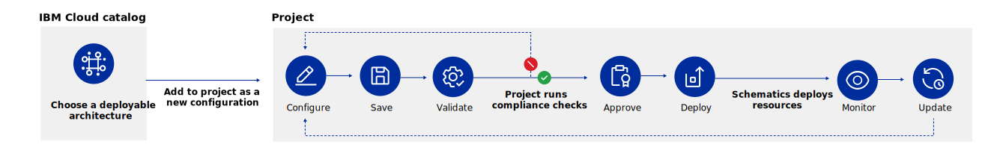

---

copyright:

  years: 2022, 2023

lastupdated: "2023-04-13"

keywords: configurations, deployments, project components, understanding projects, projects, deployable architecture, needs attention, project dashboard

subcollection: secure-enterprise

---

{{site.data.keyword.attribute-definition-list}}

# Learn about IaC deployments with projects
{: #understanding-projects}

{{site.data.keyword.cloud}} projects are a named collection of configurations that are used to manage related resources and Infrastructure as Code (IaC) deployments across accounts. They enable teams to configure, deploy, and monitor deployments by using DevOps best practices. Each project includes tools to scan for potentially harmful resource changes, compliance, security, and cost, as well as tracking configuration versioning and governance. They're designed with an IaC and a compliance-first approach that helps to ensure that a project is managed, secure, and always compliant.

{: caption="Figure 1. Understanding the projects workflow." caption-side="bottom"}

After choosing a [deployable architecture](#x10293733){: term} from the catalog, you can add its configuration to a new or existing project, and configure it to your enterprise's needs. Before you use the configuration to deploy resources to a specific environment, validation is performed on your code by completing commit checks, vulnerability scans, and cost estimations, so you that your team has all of the essential information that it needs before deploying. And, if the validation fails, the team can work to update the configuration and run the validation again until it passes. With an approval, resources can be deployed and monitored by using {{site.data.keyword.bplong}}. Then, if an update to the deployable architecture becomes available, your team is notified within your project and can update the version on your schedule.

## Benefits of projects
{: #project-benefits}

Projects help manage IaC at scale. They help ensure that the IaC and its configuration are always valid, secure, and compliant. Because a single project can deploy to different accounts, projects allow users to group related resources across accounts for better collaboration, organization, and user management. Users can get started more efficiently on {{site.data.keyword.cloud_notm}} by using projects to create resources by using deployable architectures that help build complex cloud infrastructures that are designed to meet high-availability, scalability, resiliency, and business continuity and disaster recovery (BC/DR) requirements.

* A project is a useful tool for many reasons. You can associate a set of deployable architectures, their configurations, and the resulting resources in a single interface. This helps you to manage your resources in a more secure and repeatable way, while simultaneously managing cost, status, and team activity.
* Projects offer a secure solution supply chain by ensuring that only approved deployable architectures are used to deploy resources and by leveraging trusted profiles to provide secure authorization that doesn't require key rotation and can't be misplaced.
* Projects provide governance over the configuration of IaC by ensuring that configuration changes are tracked, approved, and subject to automated validation and compliance checks.
* Projects help ensure that security and compliance issues are addressed by notifying project users of new versions and helping them get deployed in a timely manner.
* Projects allow infrastructure to be managed as code across accounts, allowing all infrastructure that is related to a project to be managed from a single place. This makes it easy to monitor that development and test infrastructure is aligned with production infrastructure by avoiding surprises as applications move through to production.
* Projects help with accounting and configuration management by ensuring that all resources that are associated with the project can be tracked back to the project by tagging and resource reports. Projects can also be tagged to provide a higher level of organization.

<!--As project functionality continues to develop, projects will offer additional benefits such as drift detection, update policy, cost, status, and compliance reporting, improved security, and project lifecycle management.-->

## Exploring popular use cases
{: #project-use}

Projects help organize and secure the configurations that you create from an IaC deployable architecture as well as the resulting resources. If you are a large organization or enterprise, there are several advantages to using {{site.data.keyword.cloud_notm}} projects. Explore these popular use cases to learn how you can adapt projects to your business needs.

Shift-left compliance and governance
:   As you deploy and operate shared infrastructure, projects help to organize and bundle the related configurations and deployments in a single location - even across different environments. Projects run predeployment security and compliance checks to ensure that your IaC deployable architecture still meets its claimed compliance at the point of deployment. A separate project administrator or editor must review and approve changes, providing an additional layer of governance.

Automated deployment across accounts
:   Projects can deploy to any account, which makes it much easier to isolate your environments in separate accounts. This enables you to organize and manage configurations across environments from a single view. Because projects deploy changes through automation, they reduce the chance of human error or deviations between environments. You can even lock down access to your most sensitive accounts and require changes to be made by using projects.

Tracking ongoing maintenance and updates
:   Projects help you to manage architecture updates and maintain compliance. In addition to conducting continuous compliance scans, projects notify you of architecture version updates, validation failures, and required cluster updates. Because projects are integrated with {{site.data.keyword.cloud_notm}}’s {{site.data.keyword.en_short}} service, you can route project notifications to Slack, PagerDuty, and other third-party tools.

Building and sharing custom architectures by using private catalogs
:   Deployable architectures are built to be modular and flexible. You can create custom deployable architectures and share them with your team by using private catalogs by adding the IaC to a new project. The IaC prompts you to select your code (you can download a code bundle from the deployable architecture’s catalog page) and uploads it to any repo you specify. After it's deployed, the IaC creates CI and CD pipelines that check changes for compliance and allow you to publish directly into a private catalog. Private catalogs make it easy to consume and push version updates to your team.

Managing the lifecycle of your infrastructure
:   Projects help you manage, track, and maintain your infastructure from start to finish. As the lifecycle of your infrastructure changes, you can use projects to easily clean up the project resources that are no longer needed. If a project is complete and is no longer needed, the whole project and all associated resources in all envionments can be deleted. In addition, a project can be paused by deleting the associated resources while retaining the project and its configurations. This makes it easy to resume the project later.

Reporting and cost management
:   Projects assist with cost management and other types of reporting by automatically tagging all created resources and by providing a resource inventory within the project. For example, when a usage report is generated the project tags will be included, allowing the accounting team to allocate costs to projects without any additional effort. Other types of configuration management tasks such as determining an inventory of particular types of applications or resources can also be accomplished by project tagging and resource views.

## Essential concepts
{: #projects-concepts}

Review the following concepts and processes to help you learn about working with projects in your account.

### Configurations
{: #configuration-projects}

A single project typically manages configurations for one or more IaC templates called deployable architectures in {{site.data.keyword.cloud_notm}}. The set of input values and the architecture that you are configuring together become a configuration. In addition to providing review and approval work flows, projects monitor each configuration for cost, compliance, and version updates from the catalog.

Typically, a project holds several configurations of each architecture. An architecture might have separate configurations for the development, test, and production environments, or for three separate regions, all of which are in the production environment.

### Deployable architectures
{: #deployable-architectures}

Projects provide governance and management for deployable architecture, which are infrastructure as code templates. Projects work with the {{site.data.keyword.cloud_notm}} catalog to ensure that only approved deployable architectures are deployed. [Custom deployable architectures can be developed](/docs/secure-enterprise?topic=secure-enterprise-customize-from-catalog) by using the tooling of your choice and can be [added to a private catalog](/docs/secure-enterprise?topic=secure-enterprise-onboard-custom) in the {{site.data.keyword.cloud_notm}} console. You must select **Deployable Architecture** as the type of product that you are onboarding for it to be used with projects.

### Project tooling
{: #tooling-projects}

Projects have internal versioned configuration storage and validation pipelines to support project goverance. Projects also leverage {{site.data.keyword.bpshort}} workspaces to store the Terraform state for each configuration and to run the automation. These workspaces are in the region and resource group that you specify when you create the project. The resources are also tagged with the project that created them, making it easier to identify among other cloud resources.

Don't delete or directly modify these workspaces. This can cause projects to lose track of the configuration state that can lead to creation of duplicate resources and other issues.
{: note}

### Trusted profiles
{: #tp-project-index}

Trusted profiles authorize cross-account access for applications. Because trusted profiles can generate unique and temporary service ID API keys that exist only during the lifecycle of the operation, projects use them as the secure and compliant way to authorize a configuration to deploy. Unlike other authentication methods, trusted profiles don't require key rotation. [Create a trusted profile](/docs/secure-enterprise?topic=secure-enterprise-tp-project#create-projects-tp) that can manage API keys for the service ID in your account, which deploys deployable architecture.

### {{site.data.keyword.secrets-manager_short}}
{: #secrets-project}

With {{site.data.keyword.secrets-manager_short}}, you can create and centrally manage secrets that are used in {{site.data.keyword.cloud_notm}} deployable architectures. Secrets are an easy and compliant way to store sensitive information, like API keys, SSH keys, database credentials, and more. Create a [{{site.data.keyword.secrets-manager_short}} service instance](/docs/secrets-manager?topic=secrets-manager-create-instance&interface=ui) in your project home account that you can use for all projects within that account.

{{site.data.keyword.secrets-manager_short}} can also be used to store API keys that are used to authorize a project to deploy resources into an account, although there are other options too. For more information, see [Using an API key or secret to authorize a project to deploy an architecture](/docs/secure-enterprise?topic=secure-enterprise-authorize-project).

### Project costs
{: #cost-projects}

While there is no charge for a project, there can be costs for any resources created by a deployable architecture. These resources are billed as normal within {{site.data.keyword.cloud_notm}}. As you customize the configuration for your deployable architecture, a starting cost is estimated based on the available data. For more information about project cost estimation, see [Cost estimation](/docs/secure-enterprise?topic=secure-enterprise-cost-estimate-project).

You're not charged while customizing a deployable architecture. You begin to incur charges after it is deployed.
{: important}

### Needs attention items
{: #notifications-projects}

Projects monitor configurations by checking to ensure that it passes various automated tests, receives approval, and is updated when new versions are available from the catalog. When the project needs attention from the user for one of these reasons, the key operational information is displayed on the project dashboard as a Needs attention item. For more information on how to address each type of needs attention notification, see [Viewing needs attention items](/docs/secure-enterprise?topic=secure-enterprise-needs-attention-projects).

Projects support sending the needs attention notifications to the {{site.data.keyword.en_full}} service, allowing them to be filtered and routed as wanted to Slack, email, and other systems.
{: note}

## Getting started with projects
{: #tutorial-next}

Now that you've learned about the basics of a project, check out how to [Configure and deploy a deployable architecture](/docs/secure-enterprise?topic=secure-enterprise-config-project) to start building and review the [Enterprise account architecture](/docs/enterprise-account-architecture) white paper to ensure that your account is set up according to {{site.data.keyword.cloud_notm}} best practices.
