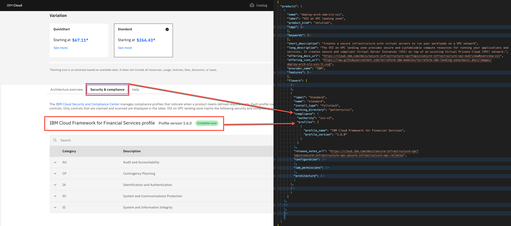
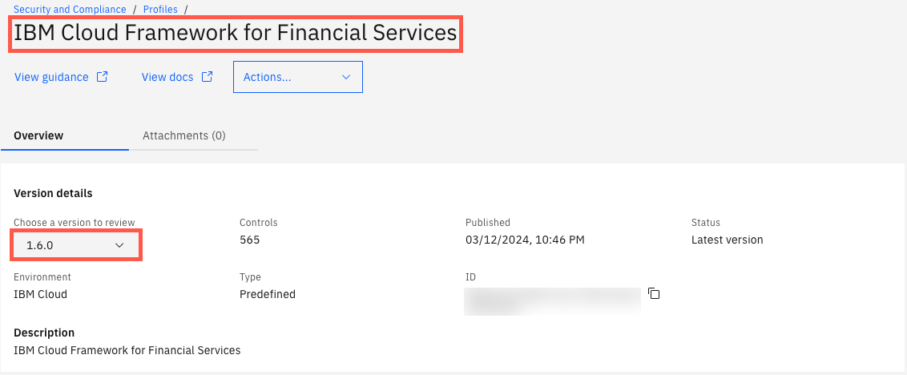

---

copyright:

  years: 2024

lastupdated: "2024-05-16"

keywords:

subcollection: secure-enterprise

---

{{site.data.keyword.attribute-definition-list}}

# Managing compliance information for your deployable architecture
{: #format-controls}

By using the `ibm_cloud.json` manifest file, you can include claims that your deployable architecture meets specific compliance requirements. After you onboard and publish your deployable architecture to the catalog, users can view which controls or {{site.data.keyword.compliance_short}} predefined profiles your product adheres to. You verify the compliance information before you onboard your deployable architecture.
{: shortdesc}

Here's an example from the VSI on VPC landing zone's catalog page where the Standard variation meets the {{site.data.keyword.framework-fs_full}} v1.6.0 profile:

{: caption="Figure 1. Deployable architecture compliance" caption-side="bottom"}

The process to make a compliance claim for your deployable architecture includes steps that must be completed before and during the onboarding process to a catalog:

1. [Choose a {{site.data.keyword.compliance_short}} profile and set up an attachment to scan your resources](#profile)
1. [Add compliance information to your `ibm_cloud.json` manifest file](#compliance-manifest)
1. [Add your scan results to your deployable architecture when you onboard](#apply-scc-scan)

## Choosing a profile and scanning your resources
{: #profile}

Before you onboard your deployable architecture to a catalog, verify compliance with a profile in {{site.data.keyword.compliance_short}}. To claim compliance, you scan the resources that the deployable architecture creates.

1. Create all of the resources in your account that your deployable architecture creates.

   Organize the resources in a single resource group to make it easier to run a {{site.data.keyword.compliance_short}} scan against only those resources in your account.
   {: tip}

1. In the {{site.data.keyword.cloud_notm}} console, click the **Menu** icon  > **Security and Compliance** > **Profiles**.
1. Select the profile name that represents the controls that are most relevant to your solution. For example, the **{{site.data.keyword.cloud_notm}} Framework for Financial Services** profile is a set of controls that are built specifically for and with the financial services industry. For a list of profiles, see [Available predefined profiles](https://cloud.ibm.com/docs/security-compliance?topic=security-compliance-predefined-profiles).
1. Select the profile from the list, and copy the profile name that displays at the beginning of the page and the version number. Save this information locally because you need these values for updating the `ibm_cloud.json` manifest file.

   {: caption="Figure 2. Profile name and version" caption-side="bottom"}

1. Click **Attachments > Create**.
1. Enter a name for the attachment, and click **Next**
1. Verify that the profile is the one that you want to use, and click **Next**.
1. Select the scope. If you organized all resources into a single resource group, set the scope to that resource group.
1. Select **Every 30 days** as the Schedule frequency, and click **Next**.

   A scan starts when you finish creating the attachment. To keep you from being charged for scans later, return to this setting and change it to **None** after you're finished onboarding your deployable architecture.
   {: tip}

1. Review your attachment details, and click **Save**.

   You see a status bar that indicates that a scan is in progress. If you need to start a one-off scan, use the Overflow menu  to select **Start scan**.

When the scan is complete, you can use the Overflow menu  to select **View scan results** to ensure that the scan on your deployable architecture resources passed the compliance checks as expected. For more information, see [Scanning your resources](/docs/security-compliance?topic=security-compliance-scan-resources) and [Viewing results](/docs/security-compliance?topic=security-compliance-results).

## Updating the compliance information in the manifest
{: #compliance-manifest}

After you identify the Security and Compliance profile name and version from the previous steps, you must add that information to the `ibm_cloud.json` catalog manifest file in your source repo.

1. If one does not exist, create a [catalog manifest file](/docs/secure-enterprise?topic=secure-enterprise-manifest-values) at the root of your repo. For an example catalog manifest file, see the [terraform-ibm-landing-zone repo](https://github.com/terraform-ibm-modules/terraform-ibm-landing-zone/blob/main/ibm_catalog.json){: external}.
1. Open the `ibm_catalog.json` file.
1. Find or add the `flavors.compliance` field for the variation (flavor) that you want to update.
1. Set `authority` to `scc-v3`.
1. Find or add a `profiles[]` array:
   1. Set `profile_name` to the profile display name you saved in the previous steps.
   1. Set `profile_version` to the version you noted in the previous steps.

   For example:
   ```json
      "authority": "scc-v3",
        "profiles": [
          {
            "profile_name": "IBM Cloud for Financial Services",
            "profile_version": "1.3.0"
          }
        ]
   ```
   {: codeblock}

1. Save the file.

## Adding a {{site.data.keyword.compliance_short}} scan during onboarding
{: #apply-scc-scan}

When you [onboard your deployable architecture in the console](/docs/secure-enterprise?topic=secure-enterprise-onboard-da&interface=ui#manage-compliance), you add your scan results so that users can see the compliance claims when they evaluate your product in the catalog.

1. On the Manage compliance page, click **Add scan**.
1. Select the {{site.data.keyword.compliance_short}} instance that you used to complete your scan in the previous steps.
1. Select the profile.
1. Select your scan.
1. Click **Apply scan**.

Now that your scan results are added, you can complete onboarding and choose to share the deployable architecture to other accounts or enterprises, or publish to the {{site.data.keyword.cloud_notm}} catalog.

## Cleaning up your resources
{: #clean-up}

To add compliance claims to your deployable architecture, you had to create the resources in your account and a {{site.data.keyword.compliance_short}} instance. To reduce future costs, you can delete all of the resources that you created during this process that you no longer need. You can keep your {{site.data.keyword.compliance_short}} instance, but set your attachment scan schedule to `None` until you're ready to rerun a scan.
