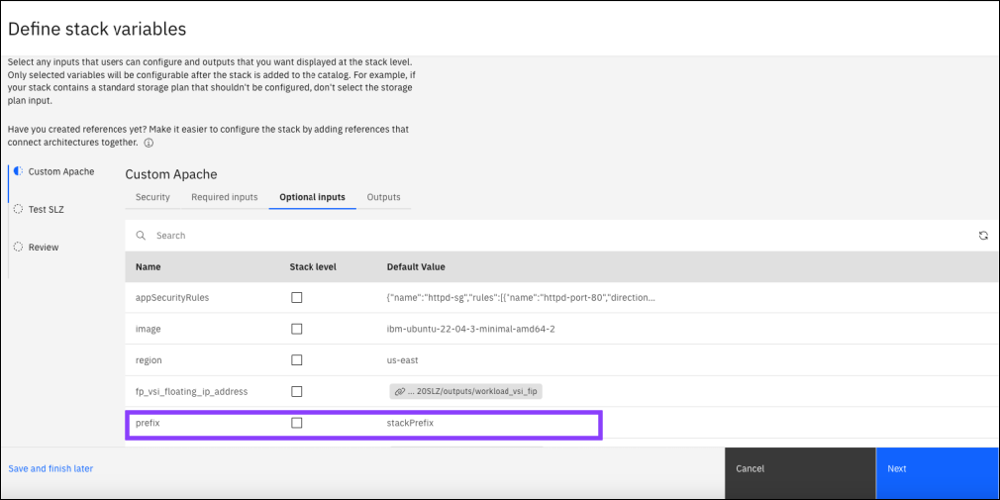

---

copyright:
   years: 2022, 2024
lastupdated: "2024-07-01"

keywords: onboard, catalog management, private catalog, stack definition, software, automation, metadata

subcollection: secure-enterprise

---

{{site.data.keyword.attribute-definition-list}}

# Locally editing the stack definition
{: #stack-definition}

The stack definition file defines the member deployable architectures that are grouped together in the stack. It specifies information about how those deployable architctures are supposed to relate to each other, like input references that connect architectures together within the stack. If you plan to share the stack with others through a private catalog, a stack definition is required to ensure the stack can be deployed successfully. 
{: shortdesc}

The stack definition contains stack variables. These variables are inputs that users can configure and outputs from deployable architectures within the stack that display at the stack level. Those input values are referenced in the member deployable architectures within the stack, as illustrated in the following image. The stack definition also includes inputs from member deployable architectures within the stack. These inputs can be references that link the member deployable architectures together. Inputs that require a specific value or reference to deploy the stack successfully need to be included in the stack definition. For an example, see [Creating the stack definition by using the CLI](/docs/secure-enterprise?topic=secure-enterprise-config-stack&interface=cli#stack-define-variables).

{: caption="Figure 1. Visualizing the stack definition" caption-side="bottom"}

## Using the console to create the stack definition in a project
{: #project-create-stack-definition}

In a project, your stack definition is created automatically when you stack deployable architectures together and define stack variables. Using the console to stack deployable architectures and define stack variables provides the following benefits: 

* You can use the reference picker in the console to create references between deployable architectures in the stack, as opposed to writing the references from scratch.
* Deploying the stack from a project helps verify the stack works as designed before others configure and deploy it. 
* Since the stack definition is created automatically based on the selections in the console, information like version locator IDs of member deployable architectures is accurate and updated automatically. 

In the project, you can select which inputs you want included at the stack level. These inputs are included in the `inputs` section of the stack definition and are configured as references in the member deployable architecture in your project. In the following image, the `prefix` input is highlighted within the `Custom Apache` member deployable architecture. If this input is selected, the `Default value` changes to a reference to the stack level input. When a user adds the stack to a project from a catalog, they can configure the `prefix` input and the `Custom Apache` member architecture will reference that value. The `fp_vsi_floating_ip_address` input references an output from another member deployable architecture. That input shouldn't be selected, as that reference links the member architectures together within the stack. Such inputs from member architectures are included in the `members` section of the stack definition file. 

{: caption="Figure 2. Defining stack variables in a project" caption-side="bottom"}

## Editing your stack definition
{: #edit-stack-definition}

To edit your stack definition locally, complete the following steps:

1. Complete the steps to [stack the deployable architectures](/docs/secure-enterprise?topic=secure-enterprise-config-stack&interface=ui#stack-architectures-ui), [define stack variables](/docs/secure-enterprise?topic=secure-enterprise-config-stack&interface=ui#stack-define-variables), and [onboard the stack to a private catalog](/docs/secure-enterprise?topic=secure-enterprise-config-stack&interface=ui#onboard-stack-ui).

   Configure and deploy the stack to verify that it works as designed before adding the stack to a private catalog. 
   {: important}

1. After the deployable architecture stack is added to your private catalog, you are taken to the **Configure version** page in the catalog. From there, click the **Actions** menu > **Export as code**. 
   
   You can also use the projects API [Get a stack definition](/apidocs/projects#get-stack-definition) method or the projects CLI [`ibmcloud project stack-definition`](/docs/cli?topic=cli-projects-cli#project-cli-stack-definition-command) command to export the stack definition. 
   {: tip}

1. Open the `stack_definition.json` file.
1. Using the example definition as a guide, edit the input and output variables.
1. Add the file into the root folder of your source code repository.

The next time that you add a new version of your stacked deployable architecture to the catalog, your updates will be included.

## Example definition file
{: #example-definition}

Though it's recommended to use a project to create the stack definition to help ensure accuracy, the following code snippet can be used as a template to create the stack definition from scratch.

```json
{
   "inputs": [
      {
         "name": "Stack input 1",
         "type": "string",
         "hidden": false,
         "required": true,
         "default" : "Default value"
      },
      {
         "name": "Stack input 2",
         "type": "string",
         "hidden": false,
         "required": true
      }
   ],
   "outputs": [
      {
         "name": "Output 1 name",
         "value": "The reference to this output value"
      },
      {
         "name": "Output 2 name",
         "value": "The reference to this output value"
      }
   ],
   "members": [
      {
         "Name": "Deployable architecture 1 name",
         "Version_locator": "",
         "inputs": [
            {
               "name": "Input 1 name",
               "value": "reference"
            },
            {
               "name": "Input 2 name",
               "value": "reference"
            }
         ]
      },
      {
         "Name": "Deployable architecture 2 name",
         "Version_locator": "",
         "inputs": [
            {
               "name": "Input 1 name",
               "value": "reference"
            },
            {
               "name": "Input 2 name",
               "value": "reference"
            }
         ]
      }
   ]
}
```
{: codeblock}


### Stack inputs
{: #value-stack-inputs}

The `inputs` value indicates an array of the input variables that are required for the stack to successfully deploy. When a user adds the deployable architecture stack to a project from a catalog, they must configure these inputs before they deploy. The following values can be included at the `inputs` level.

```json
"inputs": [
   {
      "name": "Stack input 1",
      "type": "string",
      "hidden": false,
      "required": true,
      "default" : "Default value"
   },
   {
      "name": "Stack input 2",
      "type": "string",
      "hidden": false,
      "required": true
   }
]
```
{: codeblock}

`name`
:   The name of your input variable.

`type`
:   The Terraform primitive data type of the variable. For example, `boolean` or `string`. 

`hidden`
:   A boolean that indicates whether the parameter should be hidden from users during installation.

`required`
:   A boolean that indicates whether users are required to specify the parameter during installation.

`default`
:   The default value that should be set in the catalog.


### Stack outputs
{: #value-stack-inputs}

The `outputs` value indicates an array of the output variables that are created when the stack is deployed. The following values can be included at the `outputs` level.

```json
"outputs": [
   {
      "name": "Output 1 name",
      "value": "The reference to this output value"
   },
   {
      "name": "Output 2 name",
      "value": "The reference to this output value"
   }
]
```
{: codeblock}


`name`
:   The name of your output variable.

`value`
:   The reference to where the value can be found. For more information about references, see [Referencing values](/docs/secure-enterprise?topic=secure-enterprise-config-project#reference-values).


### Member inputs
{: #value-stack-inputs}


The `members` value indicates an array of the inputs and outputs for each deployable architecture in the stack. The following values can be included at the `members` level.

```json
"members": [
   {
      "Name": "Deployable architecture 1 name",
      "Version_locator": "",
      "inputs": [
         {
            "name": "Input 1 name",
            "value": "reference"
         },
         {
            "name": "Input 2 name",
            "value": "reference"
         }
      ]
   }
]
```
{: codeblock}


`name`
:   The programmatic name of the deployable architecture included in the stack.

`version_locator`
:   Identifies the version of the member deployable architecture within the stack. To find the version locator, select the product in the catalog to open the catalog details page. Make sure that the correct version is selected. Then, click **View details**. 

`inputs`
:   Inputs to the member deployable architectures within the stack. Include inputs with specific values that are required for the deployable architecture stack to deploy. If the member architectures within the stack depend on one another, then include those values here as references. For more information, see [Referencing values](/docs/secure-enterprise?topic=secure-enterprise-config-project&interface=ui#reference-values). For example, if one of your architectures requires an output from another architecture within the stack, add a reference to the output as the value. 

   `name`
   :   The name of your input variable. Don't edit the name as it must match the input that is used in the member deployable architecture. 

   `value`
   :   The value of your input variable. A default value or a reference needs to be provided. 

