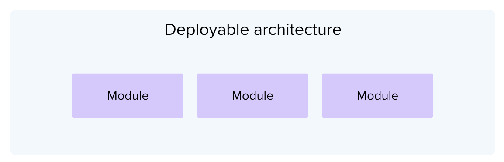
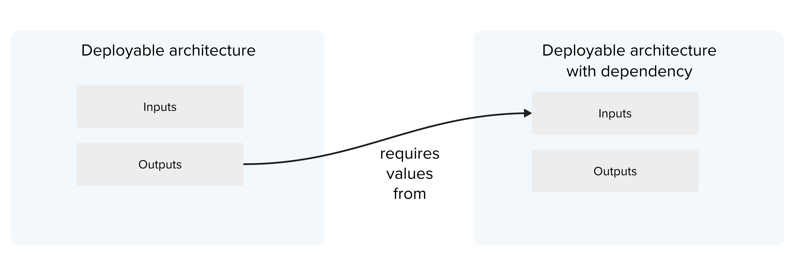
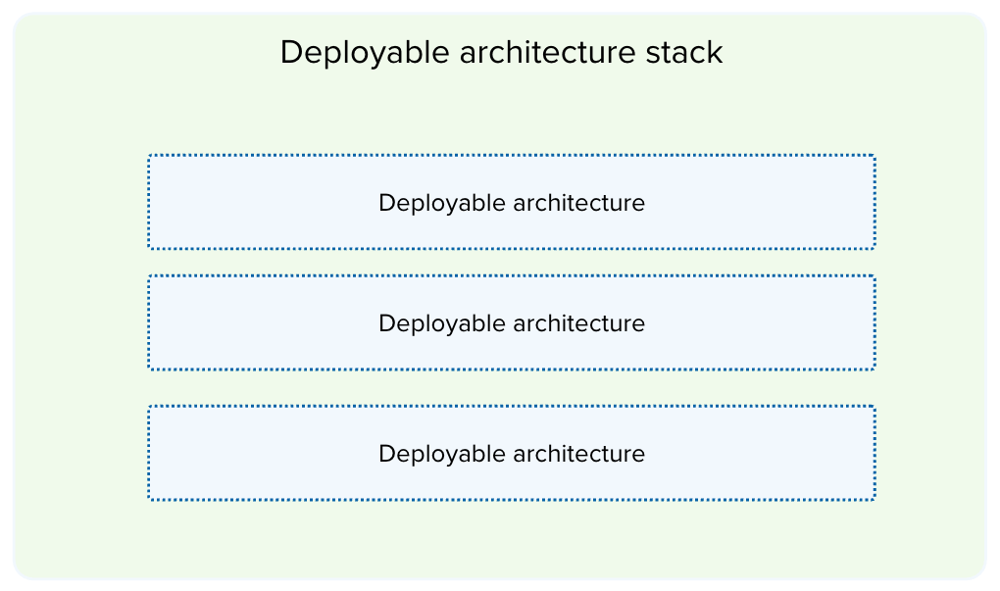

---

copyright:

  years: 2022, 2024

lastupdated: "2024-05-16"

keywords: deployable architecture, deployment architecture, da, module, infrastructure as code, what is, stack, variation

subcollection: secure-enterprise

---

{{site.data.keyword.attribute-definition-list}}

# What are modules and deployable architectures?
{: #understand-module-da}

Creating secure, compliant, and scalable application infrastructure can be difficult to set up and costly to maintain. Instead of figuring out how to assemble a compliant infrastructure architecture on your own, you can take advantage of modules and deployable architectures. Modules and deployable architectures can help you to create a framework around how resources are deployed in your organization's accounts. By working with these reusable configurations, you can define the standard for deployment once and ensure that it is easily repeatable for each member of your organization.

For example, think about an architect who is building an apartment complex. These designs are typically executed in a modular way. There are patterns for standard one-bedroom, two, or three-bedroom apartments. The builder can combine the standard apartments, each functional in their own way, into a larger, more complex, but functional living arrangement. IBM applied this same analogy to deploying solutions on the cloud. Rather than your organization spending months figuring out how to get services and software to work together, you can use {{site.data.keyword.cloud_notm}}'s well-architected patterns. Each pattern is packaged as composable, automated building bocks known as modules and deployable architectures.

## What is a module?
{: #what-is-module}

A module is a stand-alone unit of automation code that can be reused by developers and shared as part of a larger system. Similar to Node.js or Python packages, modules are a convenience to developers who are managing related resources. While it is possible to use modules alone, they're more powerful when you combine them to build a deployable architecture. Modules that are created by {{site.data.keyword.cloud_notm}} are made available in the [{{site.data.keyword.IBM_notm}} Terraform modules public GitHub org](https://github.com/terraform-ibm-modules/){: external}. For example, the [{{site.data.keyword.redhat_openshift_full}} VPC cluster on {{site.data.keyword.cloud_notm}} module](https://github.com/terraform-ibm-modules/terraform-ibm-base-ocp-vpc){: external} installs and configures a Red Hat OpenShift cluster on {{site.data.keyword.cloud_notm}}.

## What is a deployable architecture?
{: #what-is-da}

A deployable architecture is cloud automation for deploying a common architectural pattern that combines one or more cloud resources. It is designed to provide simplified deployment by users, scalability, and modularity. A deployable architecture incorporates one or more modules. Deployable architectures are coded in Terraform, which you configure with input variables to achieve the behavior that you want. In the case of a deployable architecture stack, it incorporates one or more deployable architectures that are grouped without requiring Terraform code.

{: caption="Figure 1. Deployable architecture that contains modules" caption-side="bottom"}

For example, [VPC landing zone](https://cloud.ibm.com/catalog/architecture/deploy-arch-ibm-slz-vpc){: external} is a deployable architecture that provisions several virtual private clouds in a hub-and-spoke networking pattern that is connected by a transit gateway. It includes a number of supporting services that are used for the monitoring and security of the workloads that run on the VPCs.

Deployable architectures that are built and maintained by experts at {{site.data.keyword.cloud_notm}} are made available to you in the [{{site.data.keyword.cloud_notm}} catalog](https://cloud.ibm.com/catalog#reference_architecture){: external}. If you choose to create your own version of those deployable architectures, or build one from scratch, you can onboard your deployable architecture to a private catalog and share your ready-to-deploy solution with your organization through the catalog.

A deployable architecture might include variations, have dependencies, or be stacked together to create more complex solutions.

Variations
:  A variation is a type of deployable architecture that applies differing capabilities or complexity to an existing deployable architecture. For example, there might be a Quick start variation to your deployable architecture that has basic capabilities for simple, low-cost deployment to test internally. And, you might have a Standard variation that is a bit more complex that is ready for use in production.

Dependencies
:   A deployable architecture is considered dependent upon another architecture when it has inputs that require the outputs from the other architecture to properly deploy.

   {: caption="Figure 2. Deployable architecture with a dependency on another deployable architecture" caption-side="bottom"}

Stacks [Experimental]{: tag-purple}
:   A deployable architecture stack links together multiple architectures to create an end-to-end solution. This linking is achieved by specifying references in the configuration of each architecture's inputs. You do not need to be an expert in Terraform, or have any Terraform coding skills, to create and deploy a stack.

:   Deployable architecture stacks are created with {{site.data.keyword.cloud_notm}} Projects and can be shared with others through a private catalog. A stacked deployable architecture has independent configuration states for each of the architectures in the stack. This allows each component deployable architecture to be individually deployed, updated, or undeployed independently. The deployable architecture stack derives much of its cost, compliance, support, and quality assurances from its included deployable architectures. However, each stack is uniquely versioned and has its own descriptions and architecture diagram.

   {: caption="Figure 3. Deployable architecture stack" caption-side="bottom"}

:   For an example, see the [Retrieval Augmented Generation Pattern deployable architecture](https://cloud.ibm.com/catalog/7a4d68b4-cf8b-40cd-a3d1-f49aff526eb3/architecture/Retrieval_Augmented_Generation_Pattern-5fdd0045-30fc-4013-a8bc-6db9d5447a52-global){: external}, which is assembled from separate deployable architectures. For more information, see [stacking deployable architectures](/docs/secure-enterprise?topic=secure-enterprise-config-stack). The following diagram shows how a deployable architecture stack can be made of multiple deployable architectures to create a single deployable architecture.

## What are projects and how do they work with deployable architectures?
{: #what-are-projects}

An {{site.data.keyword.cloud_notm}} project is a management tool that is designed to organize and provide visibility into a real-world project that exists in your organization. A project manages all of the configured instances of a deployable architecture and the resources that are related to the real-world reasons that they are deployed. Projects store versioned deployable architecture instances and organize the instances and resources into environments to help improve visibility into the development lifecycle. An environment is a group of related deployable architecture instances that share values for easier deployments. For example, development, test, or prod.

Projects are responsible for ensuring that only approved deployable architectures can be deployed. Additionally, they can help to ensure that the architectures and the resources that they created are up-to-date, compliant, and that drift does not occur over time. For example, you might have an account management application project. This project is designed to manage all of the resources that the account management application needs to deploy into a development, test, or production environment. Each environment has the same variables, such as a region or prefix, but has different values. When a deployable architecture is assigned to an environment through a project, their input values can automatically reference any of the environment's properties that have the same name. While {{site.data.keyword.cloud_notm}} projects are easy to create and update, they are not templatized or optimized for replication or sharing.

## How do I know which solution to create?
{: #which-component}

If you plan to create your own solution, the scope, coupling, whether it's deployable, and the purpose of your solution should all be taken into account. For guidance and use cases to help you decide what you plan to build, see [Planning and researching for designing an architecture](/docs/secure-enterprise?topic=secure-enterprise-starting-da-process) and [How do I decide what kind of component to create](/docs/secure-enterprise?topic=secure-enterprise-choose-plan-process).

The following table provides a high-level overview of why you might want to create the different components.

| Purpose | Recommended component | Why? |
|:--------|:----------------------|:-----|
| Creating a library of sharable automation components | Module | Modules provide reusable, curated automation to speed up the process for those who are creating and configuring deployable architectures. |
| Ensuring that your organization's cloud environment is secure and compliant | Deployable architecture | Deployable architectures are packaged in a way that you can define a secure and compliant deployment once and ensure that all members of your organization are repeating the deployment in the same way. |
| Architecting your own solutions | Deployable architecture stack | By combining architectures, you can create a more complex end-to-end solution for your organization. |
{: caption="Table 1. Understanding for automated deployments use-cases" caption-side="top"}
